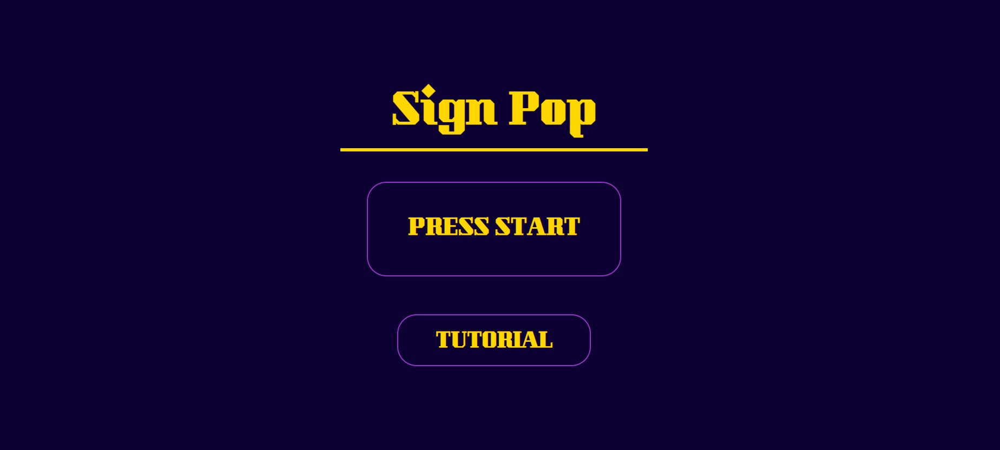

# SignPop

SignPop is an engaging and interactive learning app designed to help users master the American Sign Language (ASL) alphabet. Whether you're a beginner or looking to reinforce your skills, this app offers a fun and educational experience through step-by-step tutorials, visual demonstrations, and an exciting game mode to test your knowledge.

## Visual Demo

### Home Page

*Application home page with navigation options*

### Tutorial Mode

*Tutorial mode showing reference images and real-time hand detection*

### SignPop Game

*Game mode with falling letters that players match with hand signs*


## Features

- **Tutorial Mode**: Interactive learning environment with real-time hand gesture recognition
- **SignPop Game**: Fun game where users "pop" falling letters by performing the correct hand sign
- **Real-time Detection**: Advanced computer vision for accurate hand sign recognition
- **User-friendly Interface**: Clean and intuitive design with interactive elements

## Installation

```bash
# Clone the repository
git clone https://github.com/LanceAntor/SignPop.git
cd SignLanguageAlphabet

# Create a virtual environment
python -m venv venv
source venv/bin/activate  # On Windows: venv\Scripts\activate

# Install dependencies
pip install -r requirements.txt

# Run the application
python app.py

```
# Usage
The tutorial mode allows users to:
- **Viiew reference images for each ASL letter**
- **Practice hand signs with real-time feedbackr**
- **Toggle camera on/off for privacyr**

In the game mode, players: 
- **Form hand signs to match falling letters**
- **Score points for correct signsr**
- **Track progress with the score system**
- **Manage lives to continue playing**

## Built With

- 
- 
- 
- 
- 
- 
- 
- 
- 

# Acknowledgement

- **[Flask](https://flask.palletsprojects.com/)**: The lightweight web framework that powers the project.
- **[OpenCV](https://opencv.org/)**: For real-time computer vision and camera handling.
- **[TensorFlow](https://www.tensorflow.org/)**: For the machine learning model that powers sign detection.
- **[cvzone](https://github.com/cvzone/cvzone)**: For simplified computer vision and hand tracking utilities.
- **[NumPy](https://numpy.org/)**: For numerical operations and array handling in image processing.
- **[Font Awesome](https://fontawesome.com/)**: For offering free and high-quality icons.
- **[jQuery](https://jquery.com/)**: For simplifying DOM manipulation and AJAX interactions.
- **[ASL University](https://www.lifeprint.com/)**: For reference materials on American Sign Language.
- **[Kaggle ASL Dataset](https://www.kaggle.com/grassknoted/asl-alphabet)**: For providing training data for the sign recognition model.
